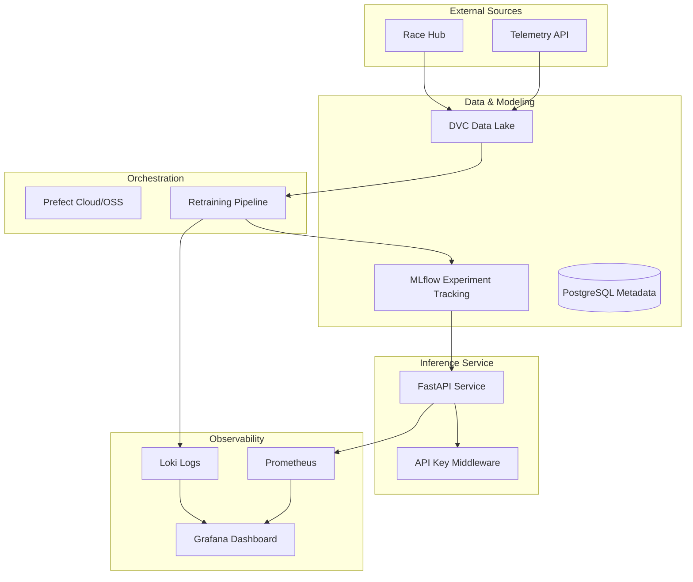

# Architecture & Data Flow

This document details the internal systems and communications of ApexFlow.

## System Architecture

ApexFlow uses a decupled, event-driven, and Dockerized architecture.

## Data Flow Lifecycle

1. **Ingestion**: Telemetry arrives and is stored in CSV format, versioned by **DVC**.
2. **Monitoring**: A background listener detects drift or new race segments.
3. **Retraining**: **Prefect** triggers a retraining flow using validated stable versions.
4. **Validation**: The **Validation Gate** compares the candidate model against production baselines using a paired t-test.
5. **Registration**: Qualified models are promoted to "Production" in the **MLflow Registry**.
6. **Inference**: The **FastAPI API** loads the production model on startup and serves predictions.
7. **Observability**: **Prometheus** tracks RPS and latency, while **Loki** aggregates logs.

## Networking

- **Internal**: Containers communicate over the `apexflow_net` bridge.
- **External**: Only the `api` (8000), `grafana` (3000), and `mlflow` (5000) ports are exposed.
